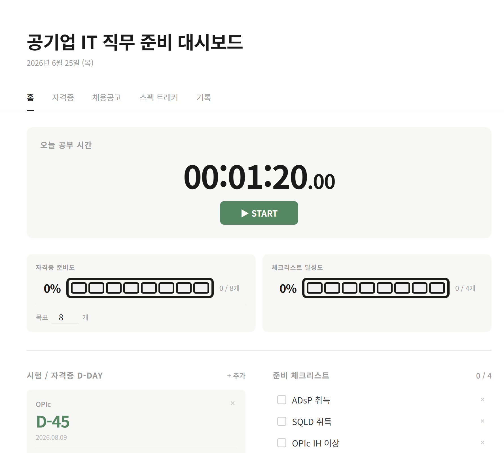
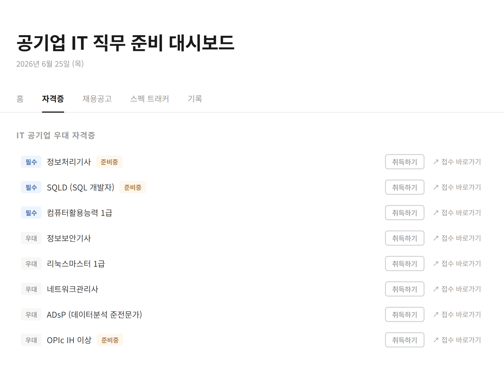
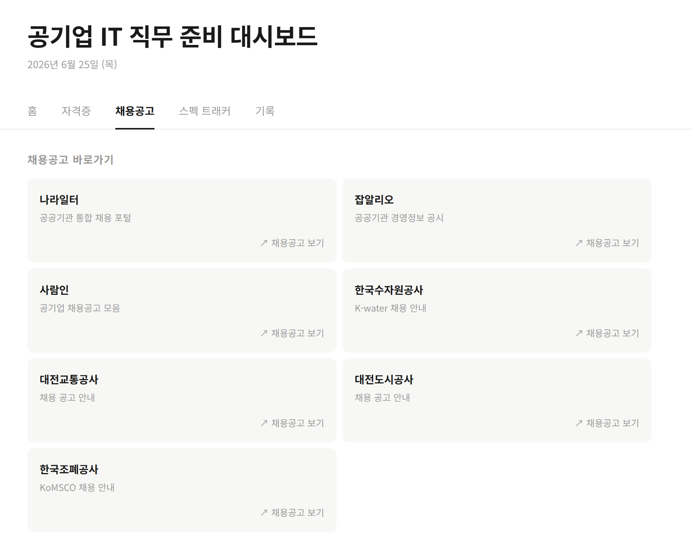
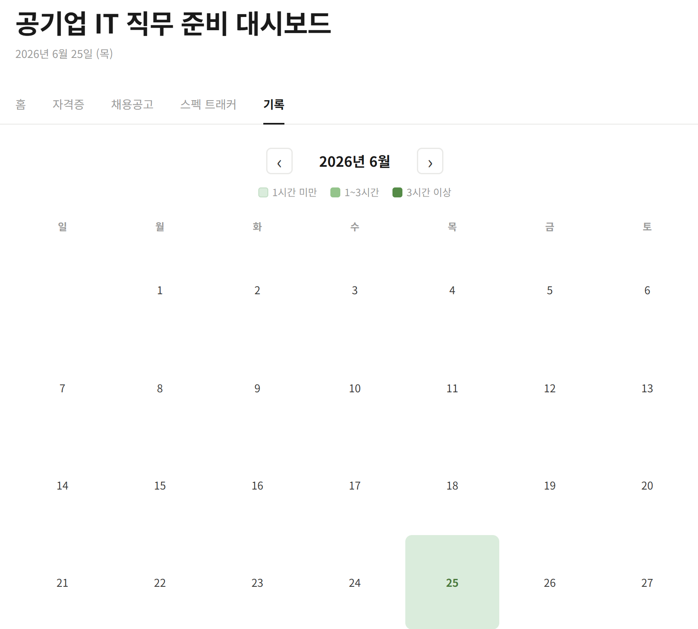

# 공기업 IT 직무 준비 대시보드

## 프로젝트 소개

공기업 IT 직무 취업을 준비하면서 시험 일정, 자격증 체크리스트, 할 일을 한 곳에서 관리하는 웹 대시보드

## 스크린샷

### 홈

### 자격증

### 채용공고

### 기록

## 주요 기능

- 공부 타이머 (ON/OFF, 하루 누적 시간 기록)
- 시험/자격증 D-Day 카운터 및 접수 바로가기
- 준비 체크리스트
- IT 공기업 우대 자격증 목록 및 취득 현황 관리
- 채용공고 바로가기 링크 모음
- 목표 합격자 vs 내 현재 스펙 비교 트래커
- 월간 학습 달력 (날짜별 공부시간 + 일기 기록)

## 트러블슈팅

### 1. Firebase 권한 오류

- 문제: FirebaseError: Missing or insufficient permissions
- 원인: Firestore 보안 규칙이 기본값(read/write: false)으로 설정됨
- 해결: Firebase 콘솔 → Firestore → 규칙 탭에서 테스트 모드 규칙으로 수정

### 2. GitHub Pages 이미지 미표시

- 문제: 로컬에서는 이미지가 보이지만 배포 URL에서는 깨짐
- 원인: img/ 폴더가 .gitignore에 의해 git 추적에서 제외됨
- 해결: git add img/ 로 명시적으로 추가 후 push

## 기술 스택

- Frontend: HTML, CSS, JavaScript (Vanilla)
- Database: Firebase Firestore
- Hosting: GitHub Pages

## 배포 URL

https://yun-seoung.github.io/it-prep-dashboard

## 실행 방법

별도 설치 없이 위 URL에서 바로 사용 가능  
로컬 실행 시 VS Code Live Server 사용
